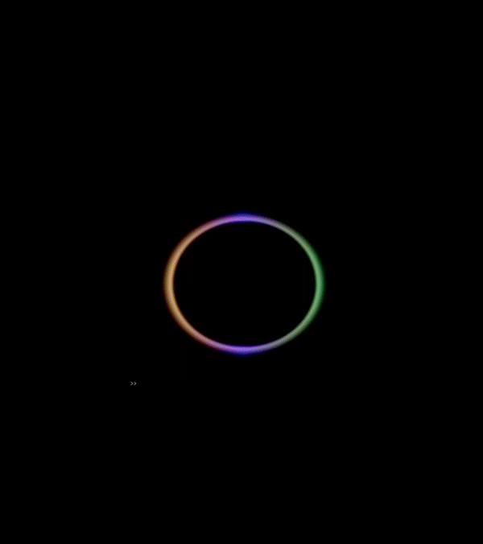
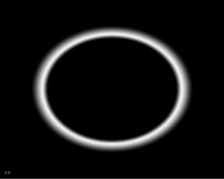
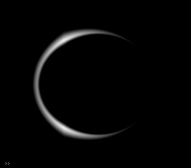
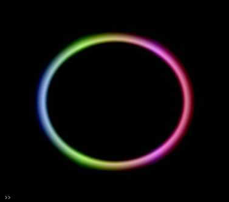
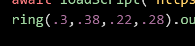

# rings
Ring object for Hydra 
 
# Types of Rings 
There are three main versions of rings: 
ring() - basic ring: 
 
mring() - modulated ring:  
 
mc_ring() - modulated color ring:  
  
## Using rings 
**load the following line of code in to the top of your Hydra project:** 
await loadScript('https://cdn.jsdelivr.net/gh/ncavazos/rings@main/rings.js')

 
There are 4 main parameters on each ring 
Parameters 1 and 2 dictate the outer ring size 
3 and 4 determine the size and blend of the inner part of ring 

Difference between param 1-2 yields a different slope
